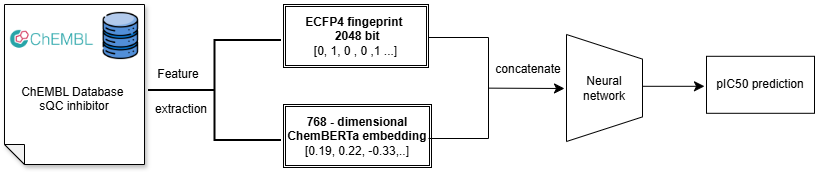

# Deep learning for QC inhibitor prediction
A hybrid deep learning framework for pIC50 regression using:
- Transformer-based molecular embeddings (ChemBERTa)
- Morgan fingerprints (ECFP4)
- Feature fusion with deep neural network

   
  <em>Figure 1. Hybrid ChemBERTa and ECFP4 fingerprint model architecture.</em>

 

## Dataset Format
The training pipeline expects three CSV files:
train_scaffold_split.csv
validation_scaffold_split.csv
test_scaffold_split.csv
Each file must contain the following columns:
- Smiles
- pChEMBL Value
### Example 
| Smiles | pChEMBL Value |
|----------|----------|
| CCOc1ccc2nc(S(N)(=O)=O)sc2c1  | 7.52 |
| CN1CCN(CC1)C2=NC3=CC=CC=C3N2| 6.84|
  
## Model architecture 
The framework consists of three main components.
### Transformer Branch
- Pretrained model: seyonec/ChemBERTa-zinc-base-v1
- Input: SMILES strings
- Maximum sequence length: 128
- CLS token embedding extracted
- Multilayer perceptron:
  - 2048 → 1024 → 512 (512-dimensional feature)
### Fingerprint Branch
- Morgan fingerprint (ECFP4)
- Radius = 2
- 2048-bit vector
- Multilayer perceptron:
  - 2048 → 1024 → 512 (512-dimensional feature)
### Fusion and Regression Head
Transformer and fingerprint features are concatenated and passed through a deep regression network:
  1024 → 512 → 256 → 128 → 1

## Training Configuration
- Batch size: 16
- Epochs: 50
- Loss: MSE
- Optimizer: AdamW
- Learning rate: 1e-3
- Weight decay: 0.01
- Scheduler: Cosine schedule with 10% warmup
The best model is selected based on the lowest validation RMSE

## How to Run
Place the dataset CSV files in the same directory as train.py, then run:
python train.py

   
  <em>Figure 2. Workflow of virtual screening for compounds against hQC enzyme.</em>

 
